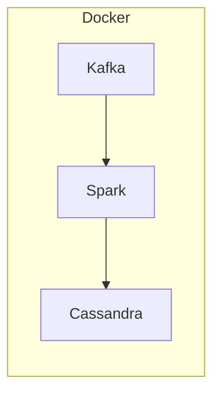

# Demo Spark Kafka Cassandra



Steps
1. Produce fake banking transactions events to Kafka
2. Consume and process events with Spark Structured Streaming
3. Store the results in Cassandra

## Docker

Build an image and get a bash shell in the container

```Shell
docker build -t spark-demo:1.0 .

docker run -ti spark-demo:1.0 /bin/bash
```

## Bash

Setup environment

```Shell
scripts/bash/setup-env.sh
```

## Python

Produce events to Kafka

```Shell
python3 scripts/python/generate-random-events.py spark-demo-events
```

```Shell
{'client': 3, 'amount': 100}
{'client': 5, 'amount': -350}
{'client': 2, 'amount': -250}
{'client': 4, 'amount': 300}
{'client': 4, 'amount': -100}
{'client': 3, 'amount': 0}
{'client': 4, 'amount': 100}
{'client': 4, 'amount': -50}
{'client': 4, 'amount': -200}
{'client': 5, 'amount': 150}
```

## Kafka

Consume events from Kafka

```Shell
$KAFKA_HOME/bin/kafka-console-consumer.sh \
--bootstrap-server localhost:9092 \
--topic spark-demo-events \
--from-beginning
```

```Shell
{"client": 3, "amount": 100}
{"client": 5, "amount": -350}
{"client": 2, "amount": -250}
{"client": 4, "amount": 300}
{"client": 4, "amount": -100}
{"client": 3, "amount": 0}
{"client": 4, "amount": 100}
{"client": 4, "amount": -50}
{"client": 4, "amount": -200}
{"client": 5, "amount": 150}
```

## Spark

Execute spark streaming app

```Shell
nohup $SPARK_HOME/bin/spark-submit \
    --packages org.apache.spark:spark-sql-kafka-0-10_2.11:2.4.3,org.apache.kafka:kafka-clients:2.1.1,com.datastax.spark:spark-cassandra-connector_2.11:2.4.3 \
    scripts/python/data-pipeline-streaming.py \
    spark-demo-events & > /dev/null
```

## Cassandra

View results

```Shell
$CASSANDRA_HOME/bin/cqlsh
```

```Shell
Connected to Test Cluster at 127.0.0.1:9042.
[cqlsh 5.0.1 | Cassandra 2.2.16 | CQL spec 3.3.1 | Native protocol v4]
Use HELP for help.
cqlsh> SELECT * FROM demo.transactions;

 client | amount
--------+--------
      5 |   -200
      2 |   -250
      4 |     50
      3 |    100
```

## Dependencies

- [kafka-python](https://kafka-python.readthedocs.io/en/master/)
- [kafka-clients](https://mvnrepository.com/artifact/org.apache.kafka/kafka-clients/2.1.1)
- [spark-sql-kafka](https://mvnrepository.com/artifact/org.apache.spark/spark-sql-kafka-0-10_2.11/2.4.3)
- [spark-cassandra-connector](https://mvnrepository.com/artifact/com.datastax.spark/spark-cassandra-connector_2.11/2.4.1)
