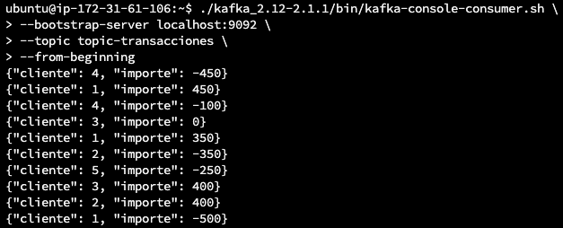
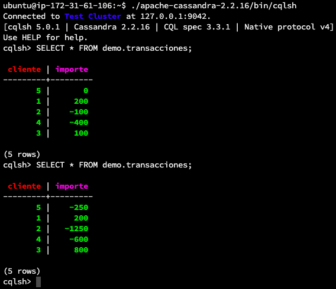

# Meetup Apache Spark México

Demo Spark Structured Streaming + Apache Kafka

## Entorno

AWS EC2 t2.large (Ubuntu Server 20.04 LTS)

```Shell
./1_configurar_entorno.sh 
```

## Kafka

Crear topic

```Shell
./kafka_2.12-2.1.1/bin/kafka-topics.sh \
--create \
--zookeeper localhost:2181 \
--replication-factor 1 \
--partitions 1 \
--topic topic-transacciones
```

Consumir mensajes de un topic

```Shell
./kafka_2.12-2.1.1/bin/kafka-console-consumer.sh \
--bootstrap-server localhost:9092 \
--topic topic-transacciones \
--from-beginning
```

## Python

Producir transacciones hacia Kafka

```Shell
python3 2_producir_transacciones.py topic-transacciones
```



## Spark

Ejecutar aplicación streaming

```Shell
./spark-2.4.3-bin-hadoop2.7/bin/spark-submit \
    --packages org.apache.spark:spark-sql-kafka-0-10_2.11:2.4.3,org.apache.kafka:kafka-clients:2.1.1,com.datastax.spark:spark-cassandra-connector_2.11:2.4.3 \
    3_kafka_spark_cassandra.py \
    topic-transacciones
```

## Cassandra

```Shell
./apache-cassandra-2.2.16/bin/cqlsh

cqlsh> SELECT * FROM demo.transacciones;
```



## Dependencias

- [kafka-python](https://kafka-python.readthedocs.io/en/master/)
- [kafka-clients](https://mvnrepository.com/artifact/org.apache.kafka/kafka-clients/2.1.1)
- [spark-sql-kafka](https://mvnrepository.com/artifact/org.apache.spark/spark-sql-kafka-0-10_2.11/2.4.3)
- [spark-cassandra-connector](https://mvnrepository.com/artifact/com.datastax.spark/spark-cassandra-connector_2.11/2.4.1)
